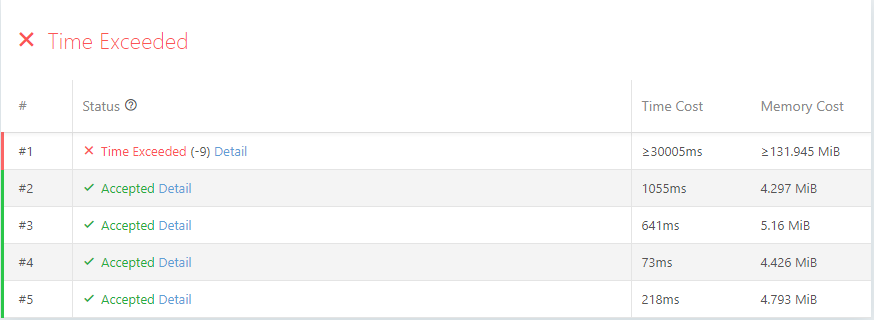

# Challenge

> Course: VE477  
> Name: Wang Hanyu  
> Student-id: 517370910174  

## Part.1 -- Problem Description
**n** warehouse with initial storage **pi** and increasement rate **ai**. Find the minimum number of trucks, which clear up the first **s** packages in the warehouses, that ensures all the warehouse has storage lower than capacity **wi** in **t** hours.

#### Input
```python
    n           # number of warehouse
    t           # number of hours in a day
    p1 a1 w1    # pi,ai,wi of warehouse
    ...
    pn an wn
```

### Output
```python
    minimum      # the minimum trucks demand
```
---
## Part.2 -- Implementation
#### Analysis
This problem expect us to find the minimized trunk numbers to keep the storage under the limitation. As in the example given in **Hint 1**:
```python
3
3
2 4 10
3 3 9
4 2 8
```
```
|  # hour  | Zizhu | Qingpu | Kunshan |
| :------: | :---: | :----: | :-----: |
|    0     |   2   |   3    |    4    |
| trunk #1 |   0   |   0    |    0    |
|    1     |   4   |   3    |    2    |
|    2     |   8   |   6    |    4    |
| trunk #2 |   0   |   4    |    4    |
|    3     |   4   |   7    |    6    |
```
Then we find that we send trunk to clean `Kunshan` when:  
- `Kunshan` is about to exceed the limit  
- `Zizhu` and `Qingpu` has too many parcels that cost to clean `Kunshan` gets too large

Thus we can conclude that Greedy algorithm can not save this problem because the previous decision will affect the priority of decision in the future. 

#### Algorithm
The idea of my algorithm is applying breadth first search with adequate pruning. I set the time to be the depth and branch if sending different amount of trucks:

##### BFS
I apply breadth first search on the interval of trucks. The queue is consists of the status with certain (time,number,package). By adding up the truck one by one and only consider the interval, **we make sure the truck number in the queue are in ascending order**. Which lead us to a wonderful conclusion: the first truck number that achieve the final time value is the optimal solution. Thus we never reach the status that has higher `count` value.

##### Prunning
I have tried several prunning approach and end up using the best two.

The first approach is to test whether a state can reach the final answer without sending another truck. This will work if the tolerance is high and the truck capacity is small. The approach enable us to jump through the process of adding truck one by one.

The second approach is to record the package storage of all the warehouse at certain `(time,count)`. If we traverse the same or worse situation at `(time,count)`, we do not need to consider it again.

The third approach is to set bound on the result. We use greedy algorithm to run the upper bound of the result, and use the abundant package divided by the truck capacity to calculate the lower bound. When searching, if the upper bound is eqaul to the lower bound, then we stop searching. However, this does not occur while testing, thus I do not use this in my solution.

#### Result
The result is tested on [JOJ](https://joj.sjtu.edu.cn/)



## Appendix
```python
#input
package_number = int(input())
capacity = int(input())
time = int(input())
package = [int(x) for x in input().split()]
package_add = [int(x) for x in input().split()]
package_capacity = [int(x) for x in input().split()]

#memorize 
mem = [[None] * (time+1)] * 10000

def transport(_package):
    _capacity = capacity
    ret = [0] * package_number
    for index in range(package_number):
        if _package[index] > _capacity:
            ret[index] = _package[index] - _capacity
            _capacity = 0
        else:
            ret[index] = 0
            _capacity = _capacity - _package[index]
    return ret
def increase(_package,value):
    ret = [0] * package_number
    for index in range(package_number):
        ret[index] = _package[index] + value * package_add[index]
    return ret
def isvalid(_package):
    for index in range(package_number):
        if _package[index] > package_capacity[index]:
            return False
    return True
def isempty(_package):
    for index in range(package_number):
        if _package[index] > 0:
            return False
    return True
def notbad(_time, _package, _count):
    if mem[_count][_time] is None:
        mem[_count][_time] = [0] * package_number
        for index in range(package_number):
            mem[_count][_time][index] = _package[index]
        return True
    for index in range(package_number):
        if _package[index] < mem[_count][_time][index]:
            for index in range(package_number):
                mem[_count][_time][index] = _package[index]
            return True
    return False

bound = 0

def upbound(_time, _package, _count):
    ret = 0
    temp_package = [0] * package_number
    for index in range(package_number):
        temp_package[index] = _package[index]
    for _ in range(time - _time):
        temp_package = increase(temp_package,1)
        while isvalid(increase(temp_package,1)) is False:
            ret = ret + 1
            temp_package = transport(temp_package) 
#    print('upbound: ' + str(ret+_count))   
    return ret + _count

def lowbound(_time, _package, _count):
    _bound = [(sum(_package)+(time - _time)*sum(package_add)-sum(package_capacity))/capacity + _count]
    for index in range(package_number-1,0,-1):
        if _package[index] + (time - _time)*package_add[index] > package_capacity[index]:
            _bound.append(sum(_package[0:index])/capacity + _count)
#    print('lowbound: ' + str(max(_bound))) 
    return max(_bound)

high = upbound(0,package,0)
low = lowbound(0,package,0)

queue = []
count = 0
flag_init = True
flag_ans = False
while isvalid(package) is False:
    transport(package)
    count = count + 1
queue.append([0,package,count])

complexity = 0

while queue != []:
    _time, _package, _count = queue[0]
    # print('time = ' + str(_time) + ', count = ' + str(_count))
    # print(_package)
    if isvalid(increase(_package,(time-_time))):
        print(_count)
        break
    complexity = complexity + 1
    if flag_init is False:
        _package = transport(_package)
        _count = _count + 1
    interval = 0
    if isempty(_package) is True:
        _package = increase(_package,1)
        interval = interval + 1
    flag_init = False
    while _time + interval <= time:
        if isvalid(_package) is False:
            break
        if _time + interval == time:
            print(_count)
            flag_ans = True
            break       
        if interval == 0 or notbad(_time+interval,_package,_count):
            queue.append([_time + interval, _package, _count])
        _package = increase(_package,1)
        interval = interval + 1
    if flag_ans:
        break
    queue.remove(queue[0])

#print('complexity = ' + str(complexity))

```